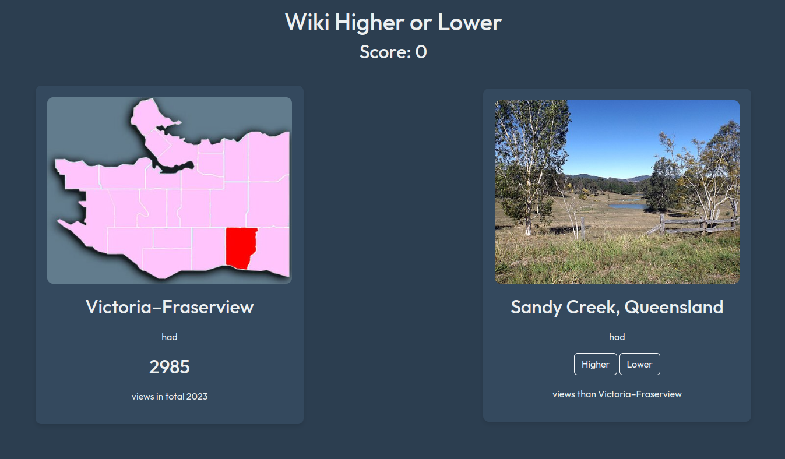

# Wiki Higher or Lower

## Overview

Inspired by the website https://www.higherlowergame.com/, I decided to make a website that does the same thing but with total wikipedia views for a year instead of google searches. This means a game where you get two articles and you guess whether the second article has higher or lower views.

Through this project, I refined my Flask and JS knowledge, as well as making API requests. I also learned to parse XML and make CSS animations.



## Live Demo

Try it out at https://nfalck.eu.pythonanywhere.com/


## Tech Stack

- **Frontend**: HTML, CSS, Bootstrap, Jinja2 Templates
- **Backend**: Flask (Python), Javascript
- **Hosting**: PythonAnywhere

## Features

- Infinite gameplay of guessing higher or lower wikipedia views on randomly generated articles
- Wikipedia & Wikimedia APIs used
- Feedback animations
- Slide animations of the articles

## Getting Started
To get a local copy up and running for development or testing, follow the steps below.

### Prerequisites

To run this application, you need to have at least Python 3.11 installed on your computer. You can download Python from [python.org](https://www.python.org/downloads/).

You also need to install required packages. You can do this by:

```shell
pip install -r requirements.txt
```

### Installation

1. Clone the repository:
```shell
git clone https://github.com/nfalck/WikiHigherLower.git
cd WikiHigherLower
```

2. Create and activate virtual environment:
```shell
python3 -m venv venv
source venv/bin/activate
```

3. Set up environment variables:

    Create a .env file and add a secret key

```
SECRET_KEY=your_secret_key
```

### Running the App Locally
**Start the Flask Development Server**:
```shell
flask run
```
Open your browser and navigate to http://localhost:5002.

## Future Improvements

- Modernize the styling of the website with smoother animations
- Exception Handling
- Add summary of every article

## License

This project is licensed under the MIT License - see the [LICENSE.md](LICENSE.md) file for details.

## Acknowledgments
- Credit to [Weafs.py](https://stackoverflow.com/questions/26558916/draw-a-check-mark-css-animation-from-left-down-to-right-up) for the checkmark SVG.
- Credit to [Christian Veigt](https://www.svgviewer.dev/s/424940/cross) for the cross SVG.
